# Лабораторная работа №1 

## Цель работы

Научиться устанавливать и настраивать _Proxmox_ для первого запуска.

## Ход работы

### 1. Установка и настройка VirtualBox

#### 1.1 Подготовка

- Для начала необходимо скачать и установить дистрибутив _VirtualBox_ с [офф. сайта](https://www.virtualbox.org/wiki/Downloads). В разделе _VirtualBox Platform Packages_ выбираем дистрибутив для нашей ОС (В моём случае это будет _Windows hosts_). 
- После скачиваем предоставленный преподователем архив с образом виртуальной машины и распаковываем.

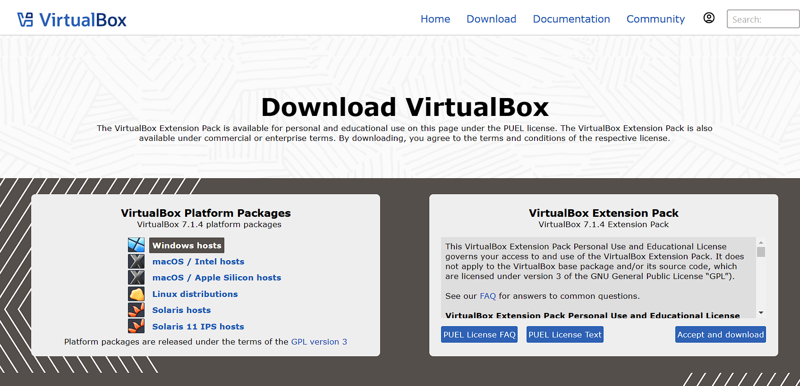

#### 1.2 Добавление вирутальной машины 
Добавить вирутальную машину Вы можете нажав на зелёный плюс (кнопка Добавить) или нажав на сочетание клавиш Ctrl-A. Переходим в папку с распакованным архивом и ищем файл `debian-12.vbox`, выбираем его. Виртуальная машина `debian-12` добавлена в _VirtualBox_. По желанию вы можете переименовать её в `proxmox`.

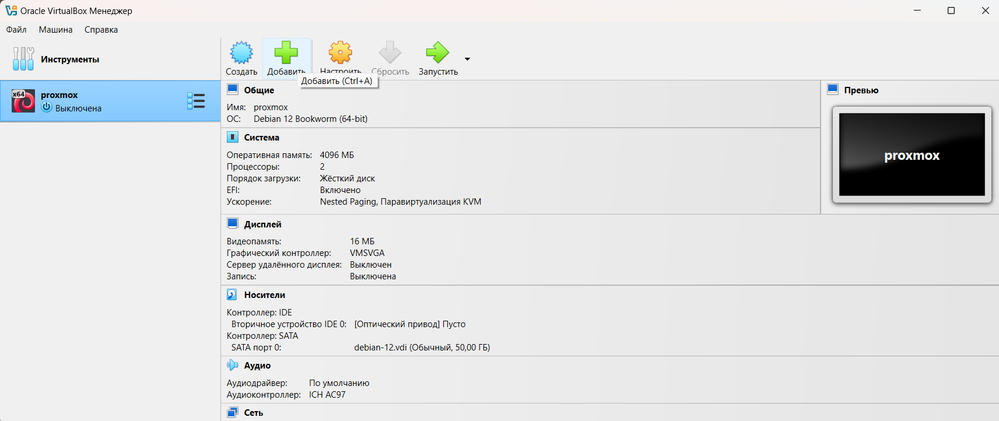

#### 1.3 Прикрепляем к Виртуальной машине диск

В меню `Инструменты` идём во вкладку `Менеджер виртуальных носителей` или нажимаем на сочетание клавиш Ctrl-D. Видим жёсткий диск `debian-12.vdi`, который система не видит, потому что его нет по предназначенному для него пути (помеченный восклицательным знаком). Выбираем и удаляем его.

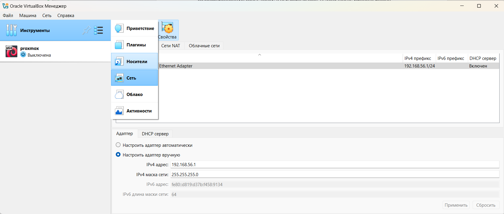

Вместо удалённого диска, добавляем диск с таким же названием из распакованного архива.

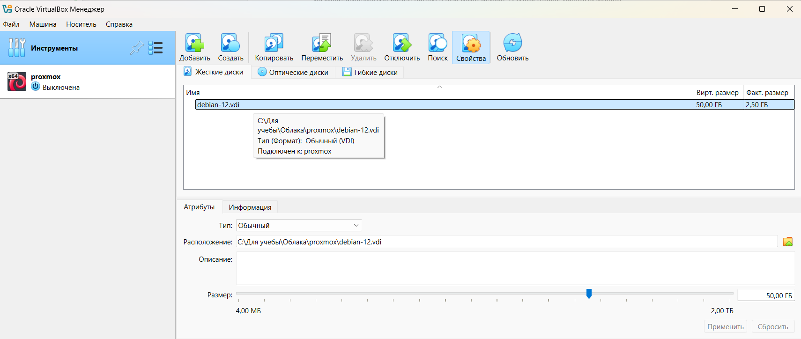

После этого идём в настройки добавленной нами виртуальной машины (правой кнопкой мыши на виртуалке или Ctrl-s). В раздел `Носители` и добавлем диск `debian-12.vdi` в `Контроллер:SATA`.

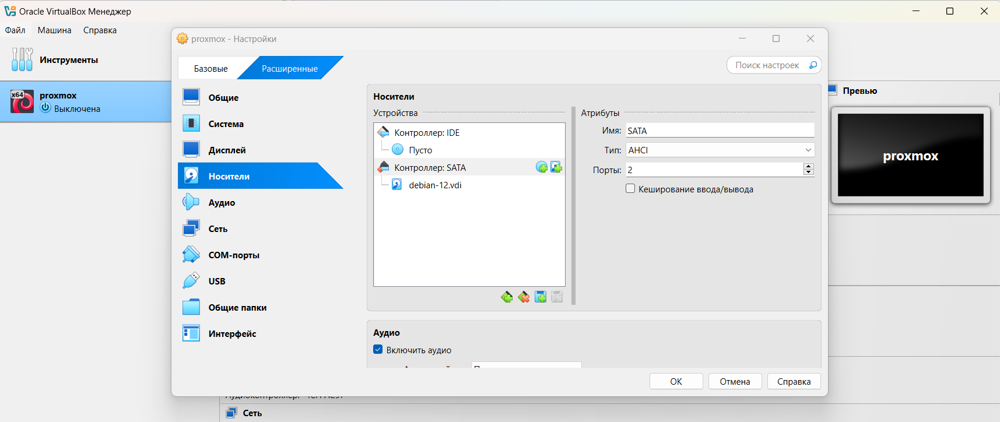


#### 1.4 Запускаем Виртуальную машину 

Запускаем машину двойным кликом или кнопкой `Запустить`. Проверяем что машина загрузилась и останавливаем её для проброса портов в следующем шаге.

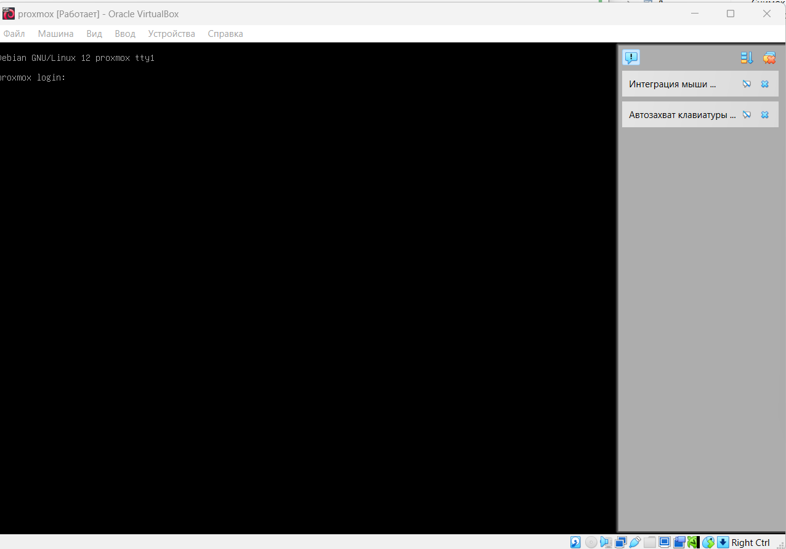

#### 1.5 Пробрасываем порты для SSH и Proxmox

Переходим в настройки виртуальной машины и выбираем пункт `Сеть` нажимаем на `Проброс портов`. Добавляем 2 новых правила для проброса портов с виртуальной машины на наши локальные порты. Включаем обратно виртуальную машину.

Добавляем проброс для SSH:
- адрес хоста: 127.0.0.1
- порт: 2222
- адрес гостя(vm): 10.0.2.15 (по умолчанию)
- порт гостя: 22

Добавляем проброс для Proxmox:
- адрес хоста: 127.0.0.1
- порт: 8006
- адрес гостя(vm): 10.0.2.15 (по умолчанию)
- порт гостя: 8006

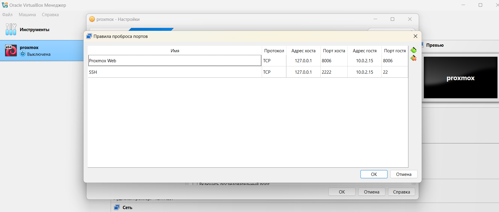

### 2. Установка proxmox на виртуальную машину

#### 2.1 Подключаем к VM по SSH

Подключиться к виртуальной машине можно либо по SSH, либо используя графический интерфейс консоли VM. Для подлючения по SSH в Windows можно использовать Windows Terminal, либо WSL с установленной Linux системой (необходимо в настройках WSL выставить настройку Networking mode в значение `Mirrored`), либо в крайнем случае скачать программу [Putty](https://www.putty.org/). Подключаться необходимо к localhost (`127.0.0.1`) с пользователем `root` (исключительно в учебных целях, так делать не стоит!) и порту 2222.

`ssh root@127.0.0.1 -p2222` (Пример комманды)

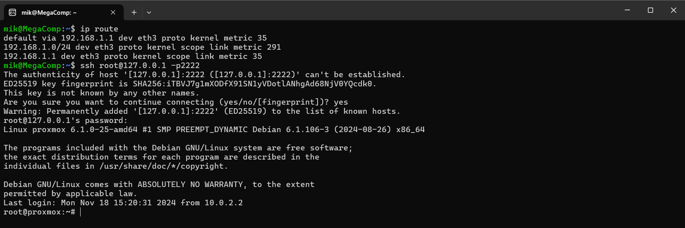

#### 2.2 Подготовка к установке Proxmox

Добавляем необходимые для установки репозитории:

```
echo "deb [arch=amd64] http://download.proxmox.com/debian/pve bookworm pve-no-subscription" > /etc/apt/sources.list.d/pve-install-repo.list
```

А так же добавляем цифровую подпись:

```
wget https://enterprise.proxmox.com/debian/proxmox-release-bookworm.gpg -O /etc/apt/trusted.gpg.d/proxmox-release-bookworm.gpg
```

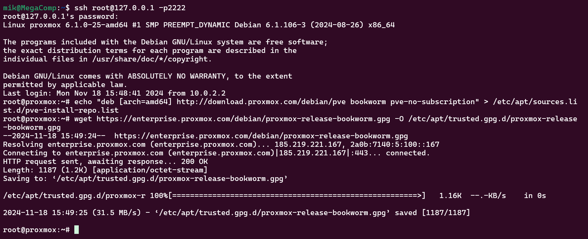

Обновляем запись в /etc/hosts, чтобы по хостнейму proxmox возвращался валидный IP-адрес (в нашем случае, внутренний адрес ВМ):

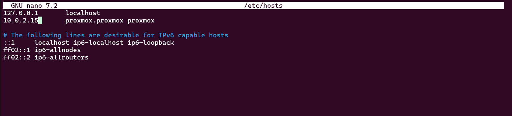

#### 2.3 Установка Proxmox

Обновляем репозитории, устанавливаем Proxmox. Главное помни ни в коем случае не используй y, только Y.

```
apt update && apt install ifupdown2 proxmox-ve open-iscsi
```

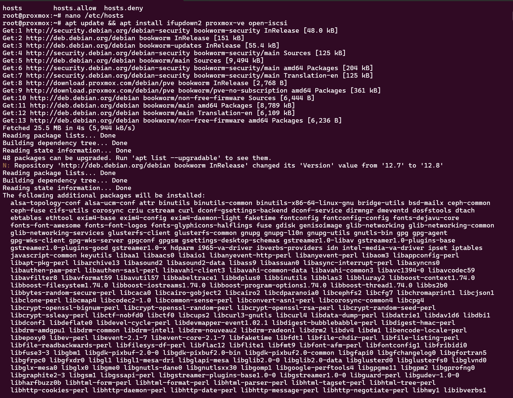

#### 2.4 Проверка успешности установки

Перезагружаем Виртуальную машину. Если после перезагрузки появилось новое приветственное сообщение, значит Proxmox успешно установился и загрузился с нового ядра.

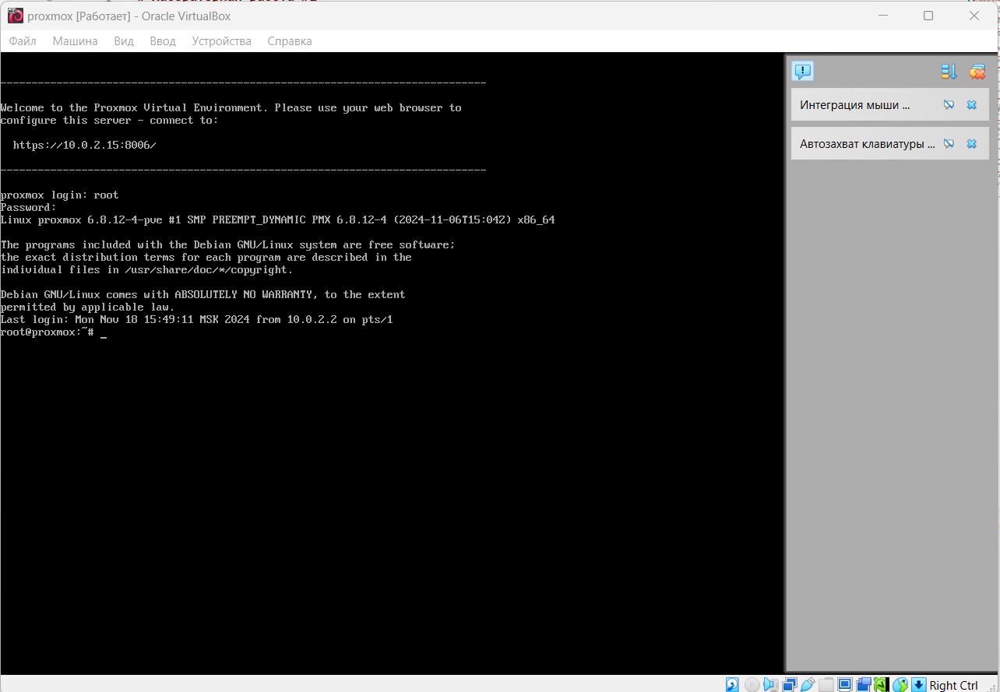

Проверяем работу proxmox в браузере. Для этого вводим адрес `https://127.0.0.1:8006`. Видим интерфейс proxmax'a. Пробуем залогиниться под `root`. На душе стало Радостно.

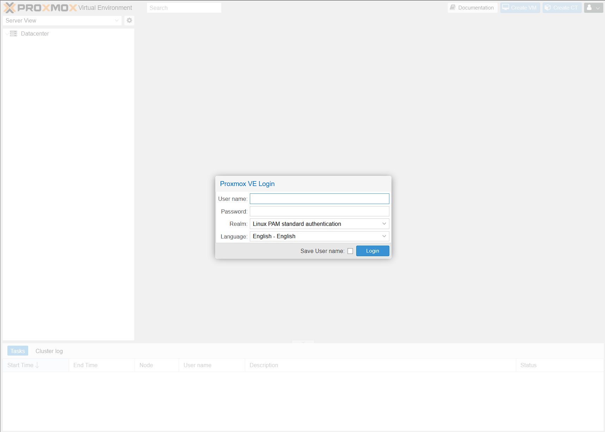

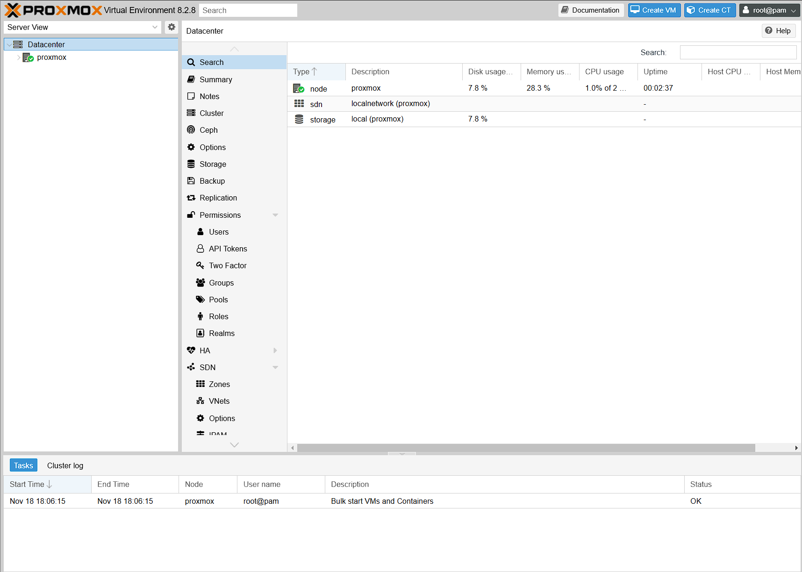

### 3. Итоги

В результате выполнения работы мы научились устанавливать proxmox и работать с VirtualBox.