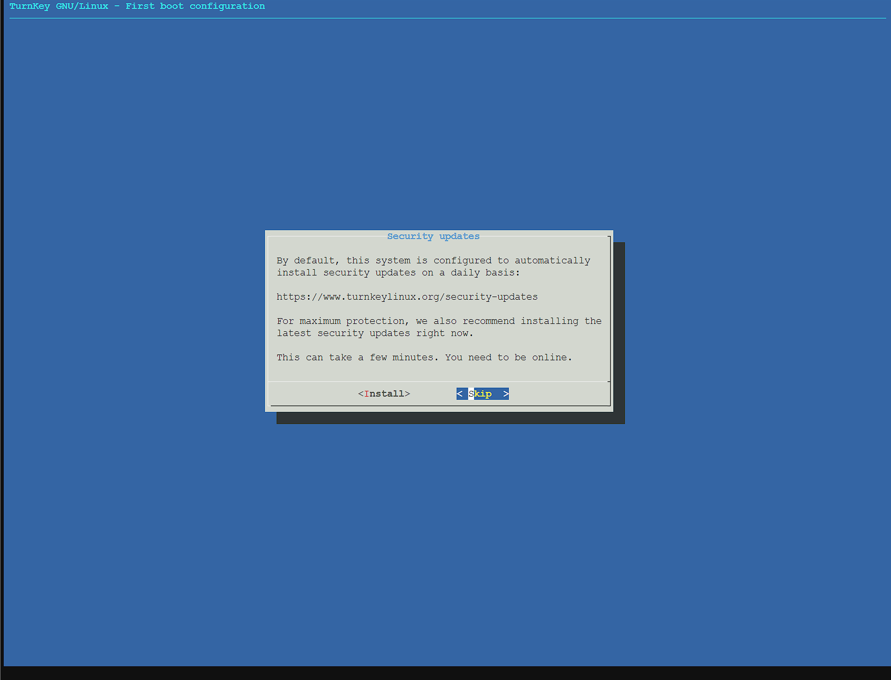
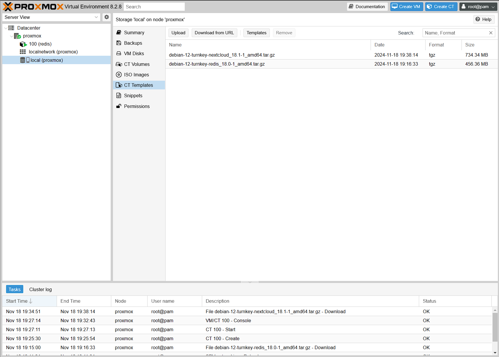
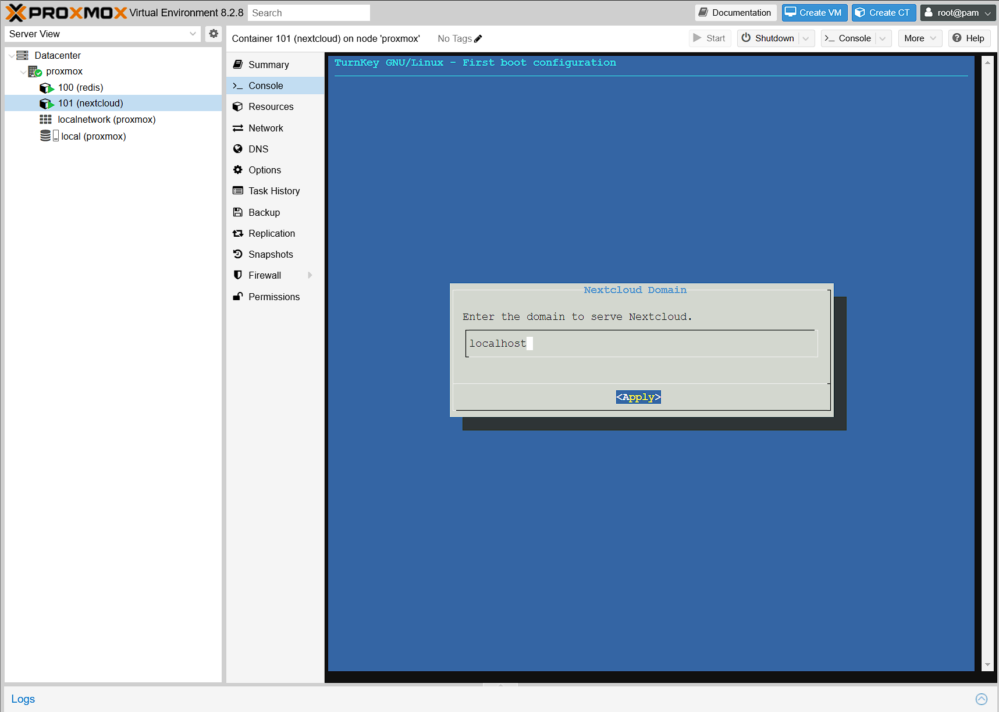

# Лабораторная работа №2: Знакомство с LXC-контейнерами

## Цель работы:
Поднять свой первый контейнер с помощью Proxmox.

## Выполнение работы

### 1. Настройка сетевого интерфейса.

#### 1.1 Подготовка
Запускаем виртуальную машину proxmox, настроенную в лабораторной работе №1 и заходим в Веб интерфейс.

#### 1.2 Создание нового сетевого интерфейса
Кликаем на ноду proxmox, переходим в раздел `System -> Network`.
По умолчанию там присутствует лишь сетевой интерфейс `enp3s0`, он же основной сетевой интерфейс ранее созданной виртуальной машины.


Для создания ВМ и контейнеров в Proxmox необходимо использовать сетевой интерфейс типа bridge, т.е. существующий интерфейс нам не подойдет.
Создаём новый, нажав Create -> Linux Bridge.


Указываем:
- IP-адрес - `10.0.2.15/24`
- В качестве шлюза - `10.0.2.2` 
- В качестве порта бриджа - имя сетевого интерфейса по умолчанию: `enp3s0`.


Проверяем что интерфейс Bridge создался и **только после этого** нажимаем кнопку `Apply configuration`. (Иначе придётся заново переделывать лабораторную работу №1)


Проверяем, что всё хорошо, для этого логинимся по SSH к VM и выполним команду `ip a`:


### 2. Установка контейнера Redis

#### 2.1. Скачиваем образ контейнера
- Для создания контейнера необходим, как минимум, его базовый образ. Это может быть обычный Linux-образ, а может быть и готовый образ с предустановленным ПО. В Proxmox это называется template (шаблон).
- В web интерфейсе proxmox перейдем в хранилища local ноды proxmox и выберем пункт меню `CT Templates`


Кликаем по кнопке `Templates` и через поиск находим нужный темплейт с redis, затем нажимаем `Download`.


#### 2.2. Создаём контейтер Redis
В правом верхнем углу нажимаем на кнопку `Create CT`.
Все настройки оставляем по умолчанию, кроме `IPv4` в разделе `Network` – там выбираем селектор DHCP.
В качестве темплейта, выбираем только что скачанный темплейт redis. Также важно запомнить Hostname и пароль на самой первой вкладке, они пригодятся далее.


Если в конце мы видим `TASK OK`, значит контейнер Redis создался успешно.

#### 2.3. Настройка контейтер Redis
Для первоначальной настройки кликаем на свежесозданный контейнер в меню и выбраем пункт `Console` (Можно также кликнуть правой кнопкой мыши и выбрать`Console`, тогда консоль запуститься в новом окне).
Логин – root, пароль - тот, что указали на первой вкладке при создании контейнера.


На самом первом шаге настройки необходимо придумать пароль для будущей админки Redis. 
Интерфейс для подключения выбираем `all`. `Protected-mode` выключаем. 
Все остальное - жмём на `skip`.




Последний экран очень важен на нем перечислены адреса и порты доступов до redis. Информацию с этого экрана необходимо сохранить. На этом этапе настройка завершена, готовым контейнером с redis можно пользоваться по назначению (выход через пункт Quit).


### 3. Установка и настройка контейра NextCloud

#### 3.1. Скачиваем образ контейнера
Делаем также как в пункте `2.1`, только вбиваем nextcloud. 




#### 3.2. Создаём контейнер с помощью коммандной строки
Подключаемся на VM proxmox по SSH и выполняем команду, предварительно заменив пароль на необходимый:

```
pvesh create /nodes/proxmox/lxc -vmid 101 -hostname nextcloud -unprivileged true -storage local -password "qwerty" -net0 "name=eth0,bridge=vmbr0,ip=dhcp,firewall=yes" -ostemplate local:vztmpl/debian-12-turnkey-nextcloud_18.1-1_amd64.tar.gz -memory 512
```


Возвращаемся в веб-интерфейс, проверяем, что появился новый контейнер:


#### 3.3. Инициализируем контейтер с NextCloud
Делаем также как в пункте `2.3`.
На моменте с Redis ожидаемо получаем ошибку, необходимо будет настроить подключение к нему позже, пока что выбираем Skip. 
В качестве Nextcloud Domain указываем localhost.





#### 3.4. Пробрасываем порты для NextCloud
Аналогично лабораторной №1 делаем проброс портов для VM proxmox. Переходимом в `Settings -> Network` виртуальной машины и жмём на `Port Forwarding`. 

Добавляем проброс для nextcloud:
- адрес хоста: `127.0.0.1`
- порт: `443`
- адрес гостя(vm): `10.0.2.17`
- порт гостя: `443`


Проверяем работу в браузере по адресу https://localhost/ - видим ошибку сервиса, т.к. nextcloud не смог найти редис.


#### 3.5. Настраиваем конфиг NextCloud
Возвращаемся в консоль nextcloud, открываем файл `/var/www/nextcloud/config/config.php` и заменяем адрес редиса на `ip/port` из шага `2.3`.
Также отключаем `Memcache`, удалив целиком строчку с `memcache.local`.


Возвращаемся в браузер и убеждаемся, что теперь форма входа в Nextcloud открывается без ошибок:


### 4. Ответы на вопросы:

**Вопрос 1**: Почему неправильная конфигурация на шаге 1.2 приведет (вероятнее всего) к полной потере сетевой доступности?

Ответ: Потому, что Bridge (vmbr0) объединяет физический сетевой интерфейс и виртуальные интерфейсы для работы виртуальных машин. Ошибки в его настройке приводят к тому, что Proxmox становится недоступным через сеть. Но насколько я понимаю это можно всё равно починить зайдя на виртуальную машину через VirtualBox, там же она вроде не через сеть связывается, а показывает терминал, как еслиб мы управляли физическим сервером.

**Вопрос 2**: Почему адрес шлюза (default gateway) виртуальной машины выглядит как 10.0.2.2, а не 10.0.2.1?

Ответ: Адрес 10.0.2.1 обычно назначается самому гипервизору, чтобы он мог управлять сетью NAT. Этот адрес может быть недоступен для ВМ, поскольку используется для внутренних нужд гипервизора, таких как маршрутизация и управление сетью.

### 5. Итоги
В результате выполнения работы мы научились создавать и настраивать контейнеры как из веб-интерфейса, так и с помощью командной строки. Установили и настроили контейнер с Redis и NextCloud.